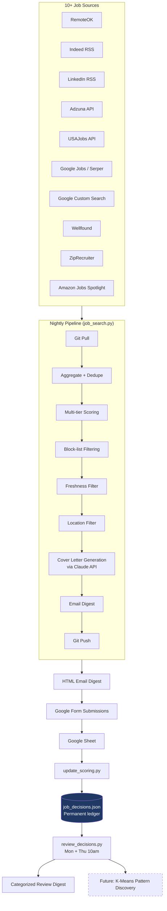

# Job Search Intelligence Pipeline

> What started as a 50-line Indeed scraper became a multi-source job intelligence system with decision tracking, twice-weekly review cycles, full mobile-to-desktop sync, AI-generated cover letters, and a foundation for K-Means pattern discovery.

A Python-based, fully automated job search pipeline that aggregates listings from 10+ sources, scores them against a user-configurable skill profile, generates tailored cover letters via the Anthropic Claude API, delivers results as an HTML email digest, and learns from every "skip" decision to continuously refine its filters.

---

## Why This Exists

Traditional job hunting has three failure modes:

1. **Aggregator noise** — sites like Indeed and ZipRecruiter are overrun with stale, dead, or irrelevant postings.
2. **Application fatigue** — every relevant role demands a tailored cover letter, which doesn't scale.
3. **No feedback loop** — when you skip a posting, that signal is lost. Tomorrow's listings repeat the same junk.

This system fixes all three. It pulls from primary sources, applies multi-tier scoring, generates per-job cover letters automatically, and treats every "skip + reason" as training data for future filter improvements.

---

## Architecture



The flow is event-driven and fault-tolerant. Every script pulls from GitHub at start and pushes at end — making the system fully sync-able from any device. Errors at any stage are captured in a persistent error log and trigger an alert email rather than failing silently.

---

## Tech Stack

**Language**
- Python 3.11+

**Core libraries**
- `requests` + `feedparser` — HTTP and RSS ingestion
- `python-dateutil` — flexible date parsing across source formats
- `python-dotenv` — environment variable management
- `anthropic` — Claude API client for cover letter generation
- `google-api-python-client` + `google-auth` — Google Sheets read access
- `tkinter` — desktop UI (Agent Hub)

**External APIs**
- Anthropic Claude (`claude-sonnet-4-6` for cover letter generation)
- Adzuna, USAJobs, Serper.dev (Google Jobs), Google Custom Search

**Infrastructure**
- Git for state synchronization across devices
- Windows Task Scheduler for nightly + twice-weekly runs
- Gmail SMTP for digest delivery
- Google Forms + Google Sheets for decision capture

**Storage**
- JSON files (`job_decisions.json`, `today_jobs.json`, `seen_jobs.json`) — chosen over SQLite for git-diffability and human-readable history

---

## Setup

**Prerequisites**: Python 3.11+, a Gmail account with an app password, and a GitHub repo for the project.

```bash
# 1. Clone the repo
git clone https://github.com/yourusername/job-search-pipeline.git
cd job-search-pipeline

# 2. Install dependencies
pip install -r requirements.txt

# 3. Create your .env file
cp .env.example .env
# Edit .env with your API keys and credentials
```

**Required environment variables** (in `.env`):

```
GMAIL_ADDRESS=your_email@gmail.com
GMAIL_APP_PASS=your_gmail_app_password
EMAIL_TO=your_email@gmail.com
CLAUDE_API_KEY=sk-ant-...
ADZUNA_APP_ID=your_adzuna_id
ADZUNA_APP_KEY=your_adzuna_key
USAJOBS_API_KEY=your_usajobs_key
SERPER_API_KEY=your_serper_key
GOOGLE_API_KEY=your_google_search_key
GOOGLE_CX=your_custom_search_engine_id
```

**Configure your skill profile** in `job_search.py` — edit the `CANDIDATE` dict, `RESUME_FULL` block, and the keyword/scoring weights to match your background.

**Schedule it**:

```
# Windows Task Scheduler triggers
job_search.bat        — Daily, 9:00 PM
review_decisions.bat  — Mondays + Thursdays, 10:00 AM
update_scoring.bat    — Daily after job_search (timing TBD)
```

---

## Sample Output

**Nightly digest email** delivers ranked jobs grouped into three tiers (Performance Engineering / AI Hybrid / COBOL fallback), each with: company, score, matched keywords, source link, and a Claude-generated cover letter pre-tailored to the posting.

> _[Screenshot placeholder: Nightly digest email with Top 10 + Amazon Spotlight A1-A5]_

**Twice-weekly decision review email** surfaces unreviewed "Other" decisions, auto-categorized into clearance / dead-link / on-site / JMeter-only / etc. — turning every skip into a filter-improvement signal.

> _[Screenshot placeholder: Review digest grouped by category]_

**Console run log** (excerpt from `job_search_run.log`):

```
============================================================
  Job Search Run: 2026-04-30 23:00:01
============================================================
[GIT] Pulling latest from GitHub...
   [OK] Already up to date.

[SEARCH] Searching RemoteOK...
   [DEBUG] RemoteOK FILTERED-level: Senior Software Engineer
   [DEBUG] RemoteOK FILTERED-score: PPC & Amazon Strategist
   [OK] RemoteOK: 3 relevant jobs found

[SEARCH] Searching Amazon Jobs spotlight...
   [DEBUG] Amazon FILTERED-non-US (toronto): Software Development Engineer...
   [DEBUG] Amazon FILTERED-non-US (bengaluru): Senior AI Engineer...
   [OK] Amazon Jobs: 0 relevant jobs found (10-day window)

[GIT] Committing and pushing local changes...
   [OK] Pushed: 'Nightly job search run — 2026-04-30'
```

---

## Roadmap

**Near-term (in progress)**

- **K-Means clustering on `job_decisions.json`** — once ~200 decisions accumulate (4–6 weeks of data), run unsupervised clustering on the decision corpus to discover hidden patterns: which sources produce the most rejections, which keyword combinations correlate with "applied" vs "skip", which company patterns are quietly toxic. The intent is to let the data tell us what new filters to build, rather than handcrafting heuristics.

- **Auto-skip on previously-rejected URLs** — cross-reference incoming URLs against `job_decisions.json` to skip jobs that were marked "Job Not Found" or "Domain Suspended" in past runs.

**Mid-term**

- **Agentic loop centerpiece** — refactor the scoring + filtering + decision logic into an LLM-driven agent that adapts its own filters based on review-cycle feedback. This is the project's big leap from rule-based to learned behavior.

- **Replication target** — apply the same agentic pattern to a second domain (e.g., RFP scraping, news aggregation) to demonstrate the architecture is generalizable, not a one-off build.

**Future / nice-to-have**

- Slack notifications as an alternative to email
- Web UI dashboard (FastAPI + a small React frontend) replacing the desktop Agent Hub
- Multi-user mode with per-user skill profiles

---

## Lessons Learned

**1. Don't fear file growth — fear unjustified complexity.**
The pipeline grew from 50 lines to ~2,000 over many months. Every line earned its place by responding to a real failure mode (a dead source, a junk aggregator, a missed keyword). Refactoring temptation is constant; resisting it until pain demands it is harder and more valuable.

**2. JSON over SQLite, until it breaks.**
Storing decisions and seen-jobs in JSON files seemed naive at first, but git-diffability turned out to be the killer feature: every nightly run produces a readable diff in commit history, making the system self-documenting. The day this breaks (likely past 10k entries), migration to SQLite is mechanical.

**3. Mobile-to-desktop sync via git is underrated.**
Drafting code on a phone over breakfast and having it execute that night required exactly one design decision: every script does `git pull` at start and `git push` at end. No webhooks, no message queues, no servers. The simplest possible synchronization primitive turned out to be sufficient.

**4. The "skip reason" field is the most valuable column in the dataset.**
Free-text rejection reasons (e.g., "Domain Suspended", "Secret clearance", "More of a Jmeter job, no LoadRunner") are richer than any structured taxonomy I could have designed up front. Categorizing them after the fact, via mapping or clustering, lets the data shape the schema rather than the other way around.

**5. Production-style error handling pays off in the first week.**
Abort on git-pull failure, send an alert email, log to a persistent error file. Boring, standard, and worth its weight in gold the first time a `.env` file gets out of sync between two machines.

**6. AI-generated artifacts need explicit anchors.**
Early cover letters had Claude calculating years-of-experience from job dates and getting it wrong. The fix was a one-line `TOTAL EXPERIENCE:` field in the resume block — give the model an explicit fact to anchor on rather than asking it to derive one.

---

## Project Status

Active development. The system runs nightly in production for the author and is being extended toward the K-Means + agentic-loop roadmap above.

## License

MIT

## Acknowledgements

Built iteratively in pair-programming sessions with Anthropic's Claude. The architectural decisions, scoring tiers, and pipeline structure are the result of many evenings of "what if we tried…" conversations.
