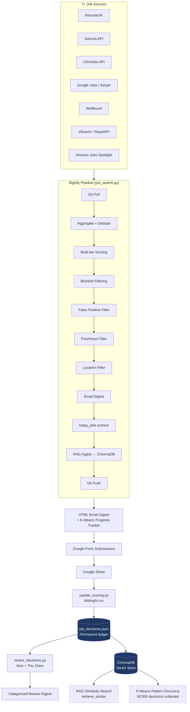

# Job Search Intelligence Pipeline

> What started as a 50-line Indeed scraper became a multi-source job intelligence system with decision tracking, RAG-powered similarity search, twice-weekly review cycles, full mobile-to-desktop sync, and a growing foundation for K-Means pattern discovery.

A Python-based, fully automated job search pipeline that aggregates listings from 7+ sources, scores them against a configurable skill profile, delivers results as an HTML email digest, and learns from every decision to continuously refine its filters. Built and iterated in production — running nightly since April 2026.

---

## Why This Exists

Traditional job hunting has three failure modes:

1. **Aggregator noise** — sites like Indeed and ZipRecruiter are overrun with stale, dead, or irrelevant postings.
2. **Application fatigue** — every relevant role demands a tailored cover letter, which doesn't scale.
3. **No feedback loop** — when you skip a posting, that signal is lost. Tomorrow's listings repeat the same junk.

This system fixes all three. It pulls from primary sources, applies multi-tier scoring, filters aggressively, and treats every "skip + reason" as training data for future improvements.

---

## Architecture



The flow is event-driven and fault-tolerant. Every script pulls from GitHub at start and pushes at end — making the system fully sync-able from any device. Errors at any stage trigger an alert email and are captured in a persistent error log rather than failing silently.

---

## Tech Stack

**Language**
- Python 3.11+

**Core libraries**
- `requests` + `feedparser` — HTTP and RSS ingestion
- `python-dateutil` — flexible date parsing across source formats
- `python-dotenv` — environment variable management
- `anthropic` — Claude API client (`claude-sonnet-4-6`)
- `google-api-python-client` + `google-auth` — Google Sheets read access
- `chromadb` — local vector database for RAG decision storage
- `sentence-transformers` — embedding model (`all-MiniLM-L6-v2`) for semantic similarity

**External APIs**
- Anthropic Claude (`claude-sonnet-4-6`) — cover letter generation (optional, togglable)
- Adzuna — job listings aggregator
- USAJobs — federal government positions
- Serper.dev — Google Jobs structured results
- JSearch (RapidAPI) — real-time Google for Jobs aggregation
- Amazon Jobs — internal employee spotlight via public careers page

**Infrastructure**
- Git — state synchronization across devices
- Windows Task Scheduler — nightly + twice-weekly scheduled runs
- Gmail SMTP — digest delivery
- Google Forms + Google Sheets — decision capture and persistence

**Storage**
- `job_decisions.json` — date-keyed permanent decision ledger (92+ entries)
- `today_jobs.json` — rolling daily batch (overwritten nightly)
- `today_jobs_YYYY-MM-DD.json` — dated archives for backfill capability
- `seen_jobs.json` — deduplication cache
- `chroma_db/` — ChromaDB vector store for RAG similarity search
- JSON over SQLite — chosen for git-diffability and human-readable commit history

---

## Key Features

### Multi-tier scoring
Three priority tracks with independent scoring weights:
- **Performance Engineering** (primary) — LoadRunner, VuGen, LRE keywords weighted highest
- **AI Engineering** (secondary) — agentic AI, LLM, prompt engineering, MLOps
- **COBOL/Mainframe** (fallback) — legacy mainframe roles as last resort

### Aggressive false-positive filtering
Beyond standard keyword scoring, the pipeline rejects:
- Training/course sites masquerading as job postings (`/events/`, `/courses/` URL paths)
- Spam aggregator domains (`2kool4u.net`, `jobisite.com`, etc.)
- Staffing firm services pages (`/services/hire-`)
- 50+ overseas job boards and non-US aggregators
- India-remote roles using 15+ location pattern variants
- Forum posts and salary pages slipping through Google Jobs results

### Decision feedback loop
Every job in the nightly email is numbered 1–10 (regular) or A1–A5 (Amazon Spotlight). A Google Form link at the bottom of each email captures decisions (Applied / Bad Link / Too Senior / Not in US / etc.) with optional free-text reasons. `update_scoring.py` reads the Google Sheet at midnight and writes decisions back to `job_decisions.json` — including full backfill of historical submissions.

### RAG similarity search (ChromaDB)
Past decisions are embedded using `all-MiniLM-L6-v2` and stored in a local ChromaDB vector store. As the decision corpus grows, `retrieve_similar()` will surface relevant past decisions when scoring new jobs — enabling the system to say "this matches the pattern of jobs you've applied to" rather than relying purely on keyword rules.

### K-Means progress tracker
Every nightly email includes a visual progress bar showing decision count toward the 300-decision K-Means threshold, with a breakdown by decision type (applied, too_senior, not_in_us, bad_link, etc.).

### Mobile-to-desktop sync
Every script does `git pull` at start and `git push` at end. Drafting a filter fix on a phone over breakfast has it deployed and running that night — no webhooks, no servers, no message queues.

---

## Setup

**Prerequisites**: Python 3.11+, Gmail account with app password, GitHub repo.

```bash
# 1. Clone the repo
git clone https://github.com/harichardson68/job-search-hans.git
cd job-search-hans

# 2. Install dependencies
pip install requests feedparser python-dateutil anthropic python-dotenv \
    google-api-python-client google-auth chromadb sentence-transformers

# 3. Create your .env file
cp .env.example .env
# Edit .env with your API keys and credentials
```

**Required environment variables** (in `.env`):

```
GMAIL_ADDRESS=your_email@gmail.com
GMAIL_APP_PASS=your_gmail_app_password
EMAIL_TO=your_email@gmail.com
CLAUDE_API_KEY=sk-ant-...
ADZUNA_APP_ID=your_adzuna_id
ADZUNA_APP_KEY=your_adzuna_key
USAJOBS_API_KEY=your_usajobs_key
SERPER_API_KEY=your_serper_key
JSEARCH_API_KEY=your_rapidapi_key
```

**Configure your skill profile** in `job_search.py` — edit the `CANDIDATE` dict, `RESUME_FULL` block, and scoring weights to match your background.

**Schedule it** (Windows Task Scheduler):

```
job_search.bat        — Daily, 9:00 PM
review_decisions.bat  — Mondays + Thursdays, 10:00 AM
update_scoring.bat    — Daily at midnight (after job_search)
```

---

## Scripts

| Script | Schedule | Purpose |
|---|---|---|
| `job_search.py` | Nightly 9pm | Main pipeline — search, score, filter, email, RAG ingest |
| `update_scoring.py` | Midnight | Read Google Sheet, write decisions to `job_decisions.json` |
| `review_decisions.py` | Mon + Thu 10am | Surface unreviewed "Other" decisions for categorization |

---

## Sample Log Output

```
============================================================
  Job Search Run: 2026-05-07 10:15:36
============================================================
[GIT] Pulling latest from GitHub...
   [OK] Already up to date.

[SEARCH] Searching Google Jobs via Serper...
   [DEBUG] Serper FILTERED-fp_domain:ishatrainingsolutions.org: Cloud Performance...
   [DEBUG] Serper FILTERED-fp_domain:2kool4u.net: AI/ML & Prompt Engineer...
   [OK] Google Jobs: 27 relevant jobs found

[SEARCH] Searching JSearch (Google for Jobs)...
   [OK] JSearch: 3 relevant jobs found

[OK] Removed 4 jobs below minimum score thresholds
[OK] Removed 13 duplicate jobs already sent previously

[STATS] Total relevant jobs found: 12
[STATS] Sending all 10 jobs to harichardson68@gmail.com

[GIT] Committing and pushing local changes...
   [OK] Pushed: 'Nightly job search run — 2026-05-07'

[RAG] Ingesting decisions into ChromaDB...
   [RAG] Upserted 92 decisions into ChromaDB
   [RAG] Total in ChromaDB: 92
```

---

## Roadmap

**Active (in progress)**

- **RAG similarity retrieval** — ChromaDB is populated and growing. Once 150+ decisions are embedded, wire `retrieve_similar()` into cover letter generation so Claude can reference past decisions when writing: *"This matches the pattern of LoadRunner + Dice jobs you've applied to before."*

- **K-Means clustering** — at 300 decisions, run unsupervised clustering on the decision corpus to discover hidden patterns: which sources produce the most rejections, which keyword combinations correlate with "applied" vs "skip", which company patterns are quietly toxic.

**Mid-term**

- **Agentic loop** — refactor scoring + filtering + decision logic into an LLM-driven agent that adapts its own filters based on review-cycle feedback. The leap from rule-based to learned behavior.

- **Replication target** — apply the same agentic pattern to a second domain to demonstrate the architecture is generalizable.

**Future**

- Slack notifications as email alternative
- Web UI dashboard replacing the Tkinter Agent Hub
- Multi-user mode with per-user skill profiles

---

## Lessons Learned

**Don't fear file growth — fear unjustified complexity.**
The pipeline grew from 50 lines to 2,000+ over months of production use. Every line earned its place by responding to a real failure mode. Refactoring temptation is constant; resisting it until pain demands it is harder and more valuable.

**JSON over SQLite, until it breaks.**
Git-diffability turned out to be the killer feature: every nightly run produces a readable diff in commit history, making the system self-documenting.

**Mobile-to-desktop sync via git is underrated.**
`git pull` at start, `git push` at end. No webhooks, no message queues, no servers. The simplest possible synchronization primitive was sufficient.

**The "skip reason" field is the most valuable column.**
Free-text rejection reasons ("Domain Suspended", "Secret clearance", "More of a JMeter job, no LoadRunner") are richer than any structured taxonomy designed up front. Let the data shape the schema.

**Production-style error handling pays off in the first week.**
Abort on git-pull failure, send an alert email, log persistently. Boring, standard, worth its weight in gold the first time a `.env` file drifts out of sync.

**Rule-based filters and learned filters solve different problems.**
Location filtering (India remote, overseas roles) will always be hard-coded rules — it's a data quality problem, not a learning problem. K-Means and RAG solve the subjective pattern recognition that rules can't capture. Knowing which layer to use matters.

---

## Project Status

Active development and nightly production use. Currently at **92/300 decisions** toward the K-Means clustering threshold. RAG infrastructure (ChromaDB + sentence-transformers) deployed and ingesting.

## License

MIT

## Author

Hans Richardson — Senior Performance Engineer pivoting to AI Engineering.
[linkedin.com/in/hans-richardson](https://linkedin.com/in/hans-richardson) | [github.com/harichardson68](https://github.com/harichardson68)

---

*Built iteratively in pair-programming sessions with Anthropic's Claude. The architectural decisions, scoring tiers, and pipeline structure emerged from months of "what if we tried…" conversations and real production failures.*
