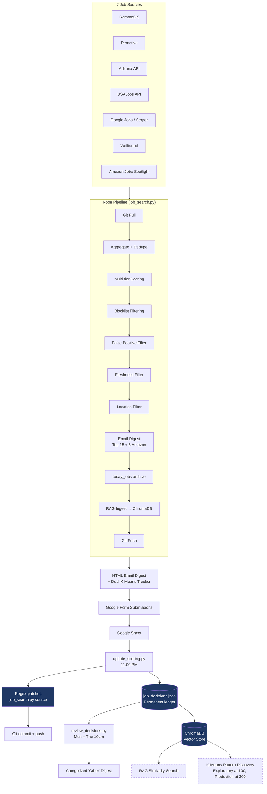

# Job Search Intelligence Pipeline

> A self-improving job search system that learns from every human decision and rewrites its own filters overnight.

A Python pipeline that aggregates listings from 7 sources, scores them against a configurable skill profile, delivers results as an HTML email digest, and **literally edits its own source code based on submitted feedback**. Built and iterated in production — running nightly since April 2026.

---

## What Makes This Different

Most "job search bot" repos are scrapers with a cover letter generator bolted on. This one is a closed-loop system: every skip, every "wrong location," every "too senior" flows back into the code itself.

**The agentic loop, concretely:**

1. **12:00 PM** — `job_search.py` fires. Pulls from 7 sources, scores against three priority tracks (Performance Engineering, AI Engineering, COBOL), filters, deduplicates, and emails the top 15 matches plus 5 Amazon Spotlight picks as an HTML digest. Each job is numbered.

2. **Throughout the day** — You submit decisions via a Google Form linked at the bottom of the email. *Applied / Bad Link / Too Senior / Salary Too Low / Not Interested / Already Seen / Search Page / Not in United States / Other.* Free-text reasons optional.

3. **11:00 PM** — `update_scoring.py` fires. Reads the Google Sheet. For each decision:
   - "Applied" → boosts the job's matched keywords in `scoring_weights.json`
   - "Bad Link" → extracts the domain and **appends it to the `BLOCKED_JOB_SITES` array inside `job_search.py`**
   - "Not in United States" + reason → **regex-patches the `NON_US_LOCATIONS` array inside `job_search.py`** to add the location
   - "Other" with "bad company: X" → **patches `blocked_companies` inside `job_search.py`**
   - Commits the diff to Git. Pushes.

4. **Next noon** — the next run uses the patched code. The system filters out Philippines listings because *yesterday you told it Philippines wasn't useful*. Git log is the audit trail of every decision the system has internalized.

5. **Mon + Thu 10:00 AM** — `review_decisions.py` fires. Surfaces any "Other" decisions whose free-text reason didn't match an auto-patch pattern. Sends a digest grouped by category (clearance, JMeter-only, internship, etc.) so the human can spot patterns worth turning into new auto-fixes.

Decisions accumulate in `job_decisions.json` indefinitely. At 100 decisions, exploratory K-Means clustering runs to validate whether the captured features carry enough signal for supervised classification. At 300, a real classifier trains on the corpus to predict decisions before the email even sends — auto-skipping jobs the human would reject anyway.

---

## Architecture



Every script does `git pull` at start and `git push` at end — making the system fully sync-able from any device. Drafting a filter fix on a phone over breakfast has it deployed and running that night. No webhooks, no servers, no message queues. Errors trigger an alert email and persist in a shared log rather than failing silently.

---

## Tech Stack

**Language**
- Python 3.11+

**Core libraries**
- `requests` + `feedparser` — HTTP and RSS ingestion
- `python-dateutil` — flexible date parsing across source formats
- `python-dotenv` — environment variable management
- `anthropic` — Claude API client (`claude-sonnet-4-6`)
- `google-api-python-client` + `google-auth` — Google Sheets read access
- `chromadb` — local vector database for RAG decision storage
- `sentence-transformers` — embedding model (`all-MiniLM-L6-v2`) for semantic similarity

**External APIs**
- Anthropic Claude (`claude-sonnet-4-6`) — cover letter generation
- Adzuna — job listings aggregator
- USAJobs — federal government positions
- Serper.dev — Google Jobs structured results
- Amazon Jobs — internal employee spotlight via public careers page

**Infrastructure**
- Git — state synchronization across devices and the audit trail for auto-patches
- Windows Task Scheduler — daily noon + nightly 11:00 PM + Mon/Thu scheduled runs
- Gmail SMTP — digest delivery
- Google Forms + Google Sheets — decision capture and persistence

**Storage**
- `job_decisions.json` — date-keyed permanent decision ledger
- `today_jobs.json` — rolling daily batch (overwritten at noon)
- `today_jobs_YYYY-MM-DD.json` — dated archives (14-day rolling retention) enabling retroactive sync
- `seen_jobs.json` — deduplication cache
- `scoring_weights.json` — auto-updated scoring weights and learned blocklists
- `chroma_db/` — ChromaDB vector store for RAG
- JSON over SQLite — chosen for git-diffability and human-readable commit history

---

## Key Features

### Multi-tier scoring
Three priority tracks with independent scoring weights:
- **Performance Engineering** (primary) — LoadRunner, VuGen, LRE keywords weighted highest
- **AI Engineering** (secondary) — agentic AI, LLM, prompt engineering, MLOps, AI observability, AI SDET
- **COBOL/Mainframe** (fallback) — legacy mainframe roles as last resort

### Aggressive false-positive filtering
Beyond standard keyword scoring, the pipeline rejects:
- Training/course sites masquerading as job postings (`/events/`, `/courses/` URL paths)
- Aggregator search pages (Glassdoor `SRCH_IL`, Indeed search URLs, etc.)
- Spam aggregator domains (`2kool4u.net`, `jobisite.com`, and others)
- Staffing firm services pages (`/services/hire-`)
- 50+ overseas job boards and non-US aggregators
- India-remote roles using 15+ location pattern variants
- Forum posts and salary pages slipping through Google Jobs results

### Self-improving auto-patcher
`update_scoring.py` doesn't just record decisions — it rewrites `job_search.py` itself. Regex matchers locate the `NON_US_LOCATIONS`, `BLOCKED_JOB_SITES`, and `blocked_companies` arrays inside the source file and append new entries based on the day's feedback. Every change commits to Git with a descriptive message. The system gets better at filtering without any manual code edits.

### Dual K-Means thresholds
The nightly email includes two stacked progress bars:
- **Exploratory milestone (100 decisions)** — at this point, an exploratory clustering pass audits whether the captured features (score, track, source, matched keywords) carry enough signal to separate "applied" from "rejected" jobs. Cheap insurance before committing to the production target.
- **Production milestone (300 decisions)** — at this point, a supervised classifier trains on the full corpus to predict decisions on incoming jobs.

This catches dataset-quality problems while fixes are still cheap, instead of grinding to 300 records and discovering the data won't train.

### RAG similarity search (ChromaDB)
Past decisions are embedded using `all-MiniLM-L6-v2` and stored in a local ChromaDB vector store. As the decision corpus grows, similarity retrieval will surface relevant past decisions when scoring new jobs — enabling the system to recognize "this matches the pattern of jobs you've applied to" rather than relying purely on keyword rules.

### Mobile-to-desktop sync
Every script does `git pull` at start and `git push` at end. The simplest possible synchronization primitive turned out to be sufficient.

---

## Setup

**Prerequisites**: Python 3.11+, Gmail account with app password, GitHub repo.

```bash
# 1. Clone the repo
git clone https://github.com/harichardson68/job-search-hans.git
cd job-search-hans

# 2. Install dependencies
pip install requests feedparser python-dateutil anthropic python-dotenv \
    google-api-python-client google-auth chromadb sentence-transformers

# 3. Create your .env file
cp .env.example .env
# Edit .env with your API keys and credentials
```

**Required environment variables** (in `.env`):

```
GMAIL_ADDRESS=your_email@gmail.com
GMAIL_APP_PASS=your_gmail_app_password
EMAIL_TO=your_email@gmail.com
CLAUDE_API_KEY=sk-ant-...
ADZUNA_APP_ID=your_adzuna_id
ADZUNA_APP_KEY=your_adzuna_key
USAJOBS_API_KEY=your_usajobs_key
SERPER_API_KEY=your_serper_key
```

**Configure your skill profile** in `job_search.py` — edit the `CANDIDATE` dict, `RESUME_FULL` block, and scoring weights to match your background.

**Set up the Google Form** with two questions and matching field names:
- `Question 1: Job Number` — short answer, regex validation `^([1-9]|1[0-5]|A[1-5])$`
- `Question 2: Decision` — multiple choice with the values listed above
- `Question 3: Reason (optional)` — short answer

Link the form's response sheet ID into `SHEET_ID` in `update_scoring.py` and `review_decisions.py`.

**Schedule it** (Windows Task Scheduler):

```
run_job_search.bat        — Daily, 12:00 PM
run_update_scoring.bat    — Daily, 11:00 PM
review_decisions.bat      — Mondays + Thursdays, 10:00 AM
```

> Why 11:00 PM instead of midnight: `update_scoring.py` matches `today_jobs.json`'s date against `date.today()`. If the scheduler fires at 12:00 AM, the date has rolled over and the match fails. Running at 11:00 PM keeps both sides on the same calendar day.

---

## Scripts

| Script | Schedule | Purpose |
|---|---|---|
| `job_search.py` | Daily 12:00 PM | Main pipeline — search, score, filter, email, RAG ingest |
| `update_scoring.py` | Daily 11:00 PM | Read Google Sheet, write decisions to `job_decisions.json`, **patch `job_search.py` source code**, commit to Git |
| `review_decisions.py` | Mon + Thu 10:00 AM | Surface unreviewed "Other" decisions for pattern recognition |

---

## Sample Log Output

```
============================================================
  Hans Richardson  Automated Job Search
  Target: LoadRunner / Performance Engineer (Remote)
============================================================
[GIT] Pulling latest from GitHub...
   [OK] Already up to date.

[SEARCH] Searching RemoteOK...
   [OK] RemoteOK: 0 relevant jobs found
[SEARCH] Searching Remotive...
   [DEBUG] Remotive: 19 raw results, status 200
   [OK] Remotive: 0 relevant jobs found
[SEARCH] Searching Google Jobs via Serper...
   [DEBUG] Serper FILTERED-searchpage: 512 performance tester Jobs in United States
   [DEBUG] Serper FILTERED-fp_domain:2kool4u.net: AI/ML & Prompt Engineer...
   [OK] Google Jobs: 5 relevant jobs found

[OK] Removed 7 jobs below minimum score thresholds
[OK] Removed 5 jobs already seen previously

[STATS] Total relevant jobs found: 5
[STATS] Sending top 5 + 1 Amazon Spotlight to harichardson68@gmail.com

[PIPELINE FUNNEL] 362 raw → 5 final (1.4% survival rate)
   Raw by source: Serper 227 | RemoteOK 99 | Remotive 16 | Wellfound 16 | USAJobs 4

[GIT] Pushed: 'Nightly job search run — 2026-05-29'

[RAG] Upserted 71 decisions into ChromaDB
```

---

## Roadmap

**Active**

- **Exploratory K-Means at 100 decisions** — validate that captured features (score, track, source, matched keywords) carry signal before committing to the production training threshold. Currently 71/100.

- **RAG similarity retrieval** — ChromaDB is populated and growing. Once the decision corpus is dense enough, wire similarity search into scoring so the system can recognize *"this matches your past LoadRunner + Dice applies"* rather than relying purely on keyword rules.

**Mid-term**

- **Supervised classifier at 300 decisions** — train a model on the full corpus to predict decisions before the email sends, auto-skipping jobs the human would reject anyway. Raises email signal-to-noise dramatically.

- **Apply the agentic-loop pattern to a second domain** — [FLAPBOARD](https://flapboard.onrender.com) is the second project: a Flask-based flight price comparison app with saved searches, price-drop email alerts, and Sky Scrapper API integration. One project is a project; two is a replicable pattern.

**Future**

- Slack notifications as email alternative
- Web UI dashboard
- Multi-user mode with per-user skill profiles

---

## Lessons Learned

**Audit your training data before you commit to collecting more of it.**
At record 71, an exploratory clustering pass costs an hour. At record 300, discovering the features don't separate the labels costs weeks. Cheap insurance.

**JSON over SQLite, until it breaks.**
Git-diffability turned out to be the killer feature: every nightly run produces a readable diff in commit history, making the system self-documenting.

**The "skip reason" field is the most valuable column.**
Free-text rejection reasons ("Domain Suspended", "Secret clearance", "More of a JMeter job, no LoadRunner") are richer than any structured taxonomy designed up front. Let the data shape the schema.

**Rule-based filters and learned filters solve different problems.**
Location filtering (India remote, overseas roles) will always be hard-coded rules — it's a data quality problem, not a learning problem. K-Means and RAG solve the subjective pattern recognition that rules can't capture. Knowing which layer to use matters.

---

## Project Status

Active development and daily production use.

## License

MIT

## Author

Hans Richardson — 24+ years in enterprise IT, pivoting from LoadRunner performance engineering into AI engineering.
[linkedin.com/in/hans-richardson](https://linkedin.com/in/hans-richardson) | [github.com/harichardson68](https://github.com/harichardson68)

---

*Built iteratively in pair-programming sessions with Anthropic's Claude. The architectural decisions, scoring tiers, and pipeline structure emerged from months of "what if we tried…" conversations and real production failures.*
